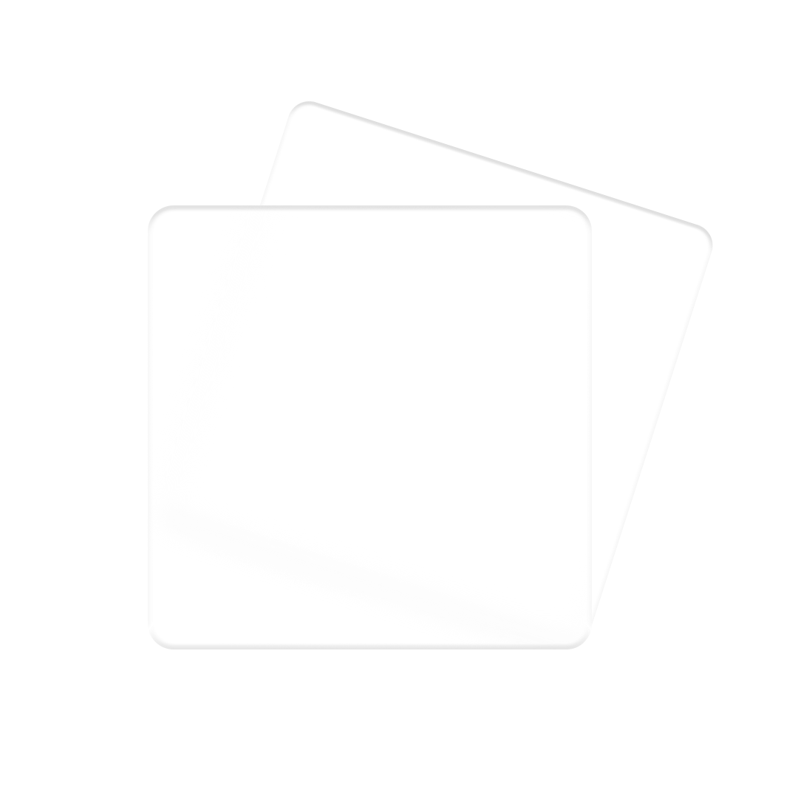

<p align="center">
    
</p>

# Mosha UI

A Vue 3 UI Library that loves glassmorphism!

(🚀Under construction)

[Read the Docs to Learn More](https://szboynono.github.io/mosha-ui/).

### Installation

You can install Mosha UI through NPM or Yarn:

With NPM:

```bash
$ npm install mosha-ui
```

With Yarn:

```bash
$ yarn add mosha-ui
```

### Import Mosha UI

You can import the entire library, or just import what you need.
Importing the whole library:

```js
/** src/main.js */
import { createApp } from 'vue'
import App from './App.vue'
import mosha from 'mosha-ui'
import 'mosha-ui/dist/style.css'

const app = createApp(App)

app.use(mosha)
app.mount('#app')
```

Import only selected components:

```js
/** src/main.js */
import { createApp } from 'vue'
import App from './App.vue'
import { Button, Alert } from 'mosha-ui'
import 'mosha-ui/dist/style.css'

const app = createApp(App)

app.use(Button)
app.use(Alert)
app.mount('#app')
```
### Add required assets

Mosha UI uses icons from material design and google font, please include the aseets in your index.html
```html
<link href="https://fonts.googleapis.com/css2?family=Roboto:wght@300;400;700&display=swap" rel="stylesheet">
<link href="https://fonts.googleapis.com/css?family=Material+Icons|Material+Icons+Outlined|Material+Icons+Two+Tone|Material+Icons+Round" rel="stylesheet">
```
